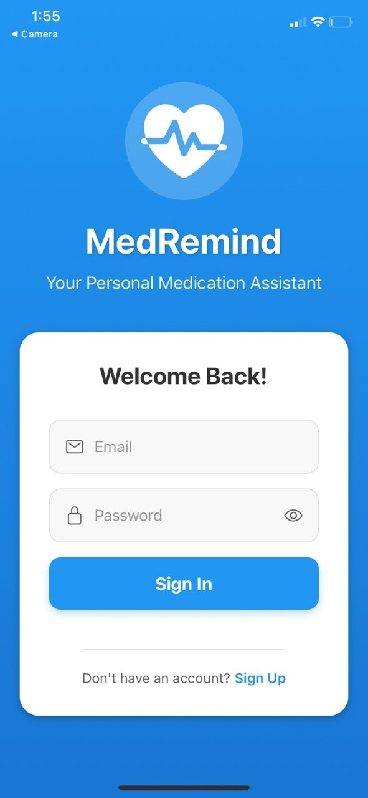
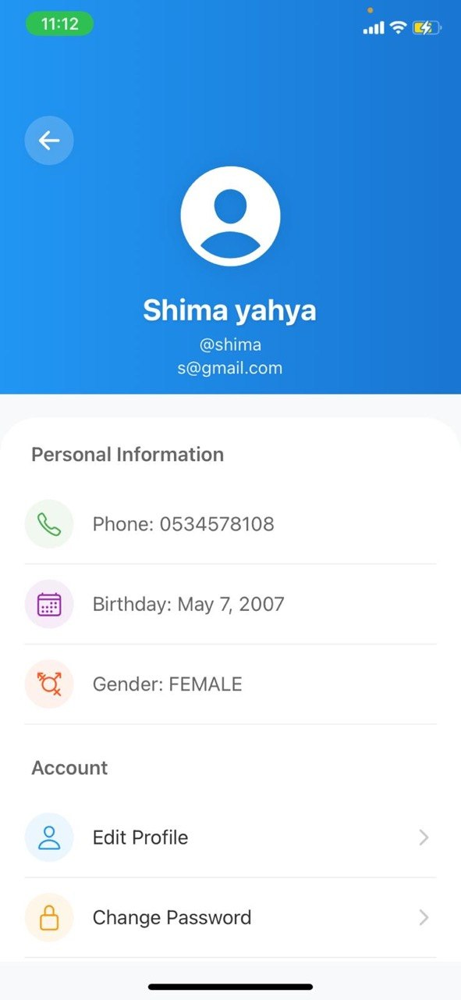
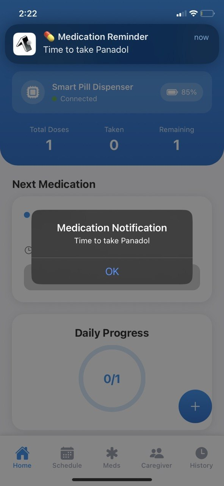
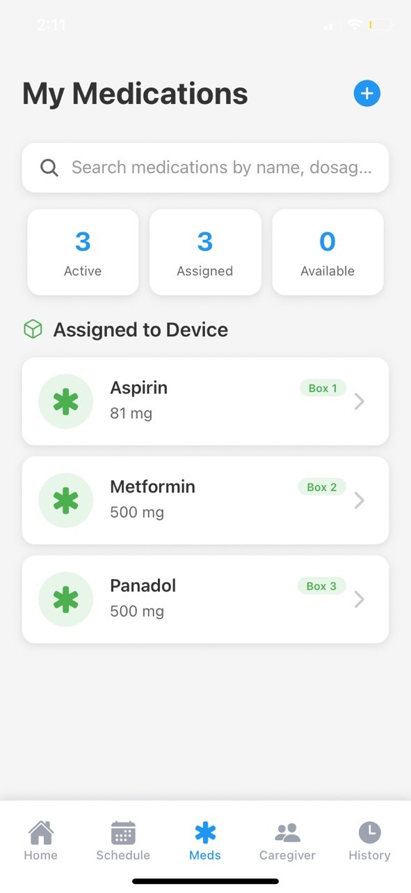
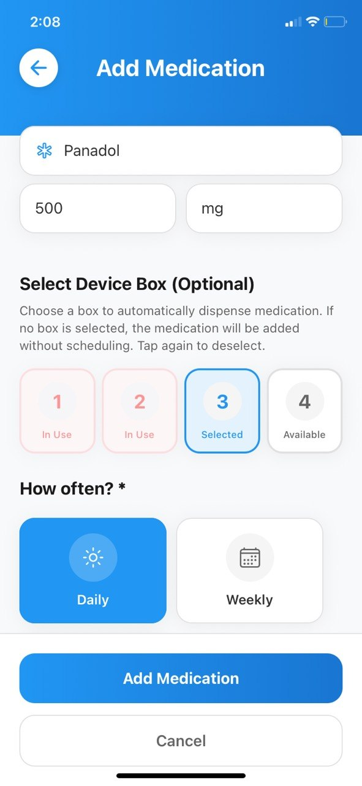
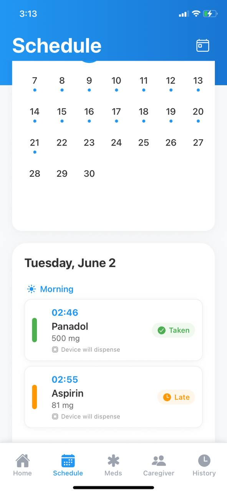
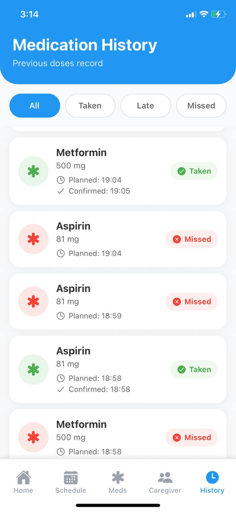
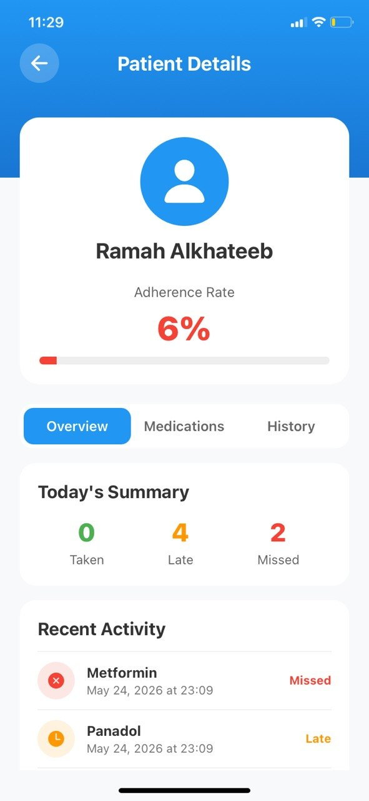
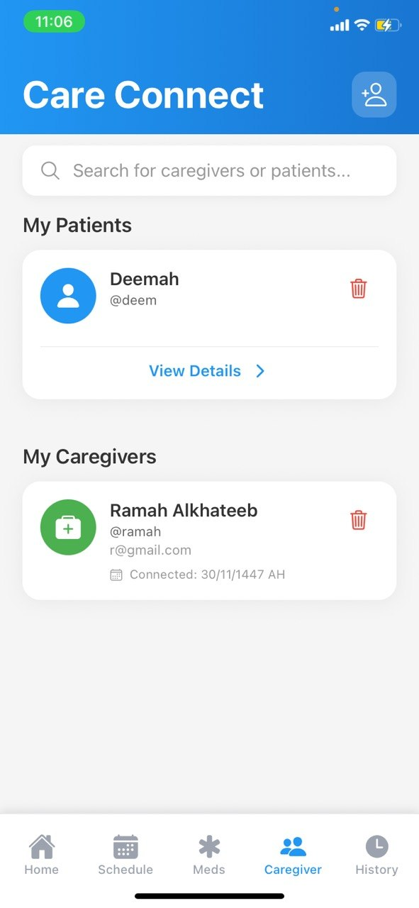

# 💊 MedRemind

MedRemind is a cross-platform healthcare mobile application developed using **React Native (Expo)** to help patients manage their medications through reminders, medication scheduling, adherence tracking, caregiver support, and smart pill dispenser integration.

The project was developed as part of a university **Software Engineering team project**, combining mobile application development, backend services, and IoT technologies.

---

## 📱 Features

### 👤 Patient Features

- Secure user authentication (Sign Up & Login)
- Add, edit, and delete medications
- Schedule medication reminders
- Smart medication calendar
- Daily medication schedule
- Medication history tracking
- Medication adherence monitoring
- User profile management
- Clean and intuitive mobile interface

### 👨‍⚕️ Caregiver Features

- Search and connect with patients
- View patient medication schedules
- Monitor patient adherence
- Manage connection requests

### 🔗 Smart Pill Box Integration

- Connect with a Smart Pill Box
- Monitor device connection status
- Synchronize medication information between the application and the device

---

## 🛠️ Technologies Used

### Mobile Development

- React Native
- Expo
- JavaScript
- Expo Router
- React Hooks

### Backend Integration

- REST APIs

### Development Tools

- Visual Studio Code
- npm

---

## 👥 Team Project

This application was developed as part of a university Software Engineering team project.

### 👩‍💻 My Contribution – Frontend Developer

I was responsible for designing and developing the mobile application's frontend using **React Native (Expo)**.

My responsibilities included:

- Designing and implementing the user interface.
- Developing responsive mobile screens.
- Creating reusable UI components.
- Integrating frontend screens with backend REST APIs.
- Implementing application navigation.
- Improving the overall user experience.

### 🤝 Other Team Contributions

- **Backend & Database:** API development, authentication, and database implementation.
- **IoT Integration:** Development of the Arduino-based Smart Pill Box and hardware integration.

---

## 📂 Project Structure

```text
app/
components/
assets/
hooks/
services/
styles/
utils/
```

---

## 🚀 Getting Started

### Prerequisites

- Node.js
- npm
- Expo Go

### Installation

Clone the repository:

```bash
git clone https://github.com/YOUR_USERNAME/medremind-app.git
```

Install the dependencies:

```bash
npm install
```

Run the application:

```bash
npx expo start
```

Open the application using **Expo Go** or an Android/iOS emulator.

---

## 📸 Screenshots


### 🔐 Authentication & Profile

<p align="center">
  <table>
    <tr>
      <td align="center">
        
        <br />
        <strong>🔐 Login</strong>
        <br />
        <em>Secure user authentication</em>
      </td>
      <td align="center">
        
        <br />
        <strong>👤 Profile</strong>
        <br />
        <em>Manage personal information</em>
      </td>
      <td align="center">
        
        <br />
        <strong>🔔 Notifications</strong>
        <br />
        <em>Medication reminders & device status</em>
      </td>
    </tr>
  </table>
</p>

### 💊 Medication Management

<p align="center">
  <table>
    <tr>
      <td align="center">
        
        <br />
        <strong>💊 My Medications</strong>
        <br />
        <em>View all active medications</em>
      </td>
      <td align="center">
        
        <br />
        <strong>➕ Add Medication</strong>
        <br />
        <em>Add and schedule new medications</em>
      </td>
      <td align="center">
        
        <br />
        <strong>📅 Schedule</strong>
        <br />
        <em>Daily medication calendar view</em>
      </td>
    </tr>
  </table>
</p>

### 📊 Tracking & Caregiver

<p align="center">
  <table>
    <tr>
      <td align="center">
        
        <br />
        <strong>📋 History</strong>
        <br />
        <em>Track medication adherence</em>
      </td>
      <td align="center">
        
        <br />
        <strong>👨‍⚕️ Patient Details</strong>
        <br />
        <em>Monitor patient adherence</em>
      </td>
      <td align="center">
        
        <br />
        <strong>🤝 Care Connect</strong>
        <br />
        <em>Connect with patients & caregivers</em>
      </td>
    </tr>
  </table>
</p>

---

## 🎯 Future Improvements

As the frontend developer of this project, I plan to continue improving MedRemind by independently implementing:

- Backend services
- Database architecture
- Cloud deployment
- Enhanced notification system
- Dark mode
- Multi-language support
- Accessibility improvements

---

## 📖 Project Information

**Project Type:** University Software Engineering Project

**Platform:** Cross-platform Mobile Application

**Framework:** React Native (Expo)

---

## 📄 License

This project was developed for educational purposes as part of a university Software Engineering course.

---

## 👩‍🎓 Author

**Ramah Alkhateeb**

Software Engineering Graduate

Interested in **Full-Stack Development**, **Mobile Application Development**, and **User-Centered Software Solutions**.